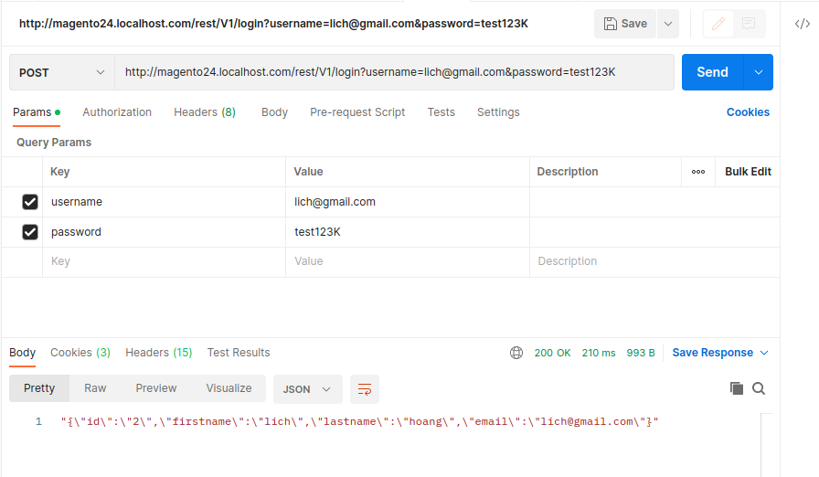

## Exercise 1:

### 1/ Create a new product attribute with the name: Allow multi-order (yes/no)

### 2/ When the customer click adds to cart button.

### 4/ In case, the guest is creating an order. If the order is successful, please create a new customer account with the shipping address to which the customer filled in the shipping address form.

### 5/ The third party needs a rest API on the Magento side to support customer login in the Magento system. Please create a new rest API to support them.

## Exercise 2: Delivery time

### Backend Configuration:

### Frontend:

